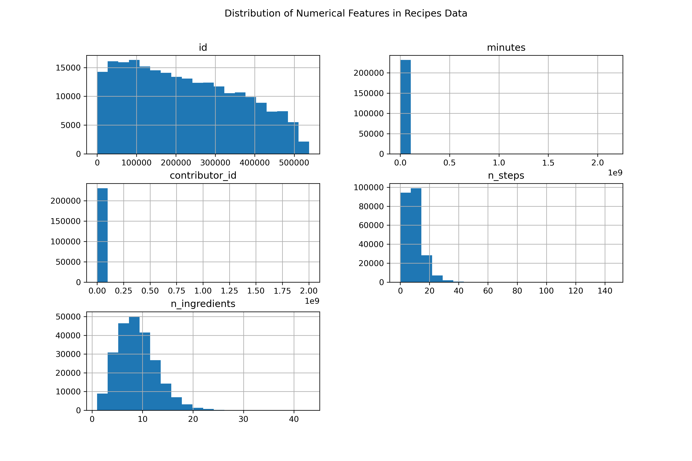
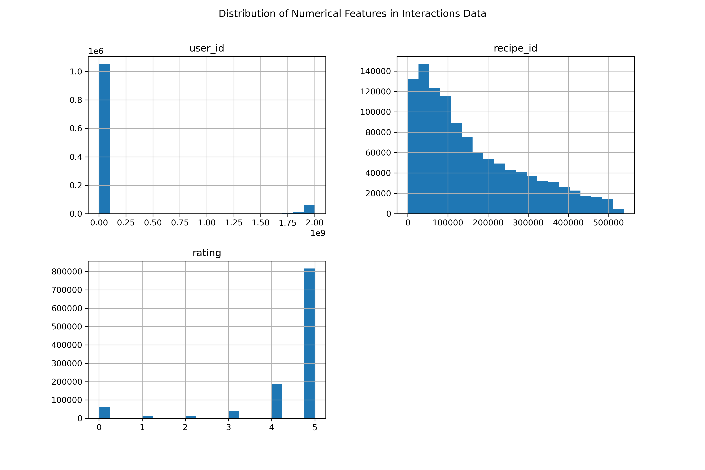
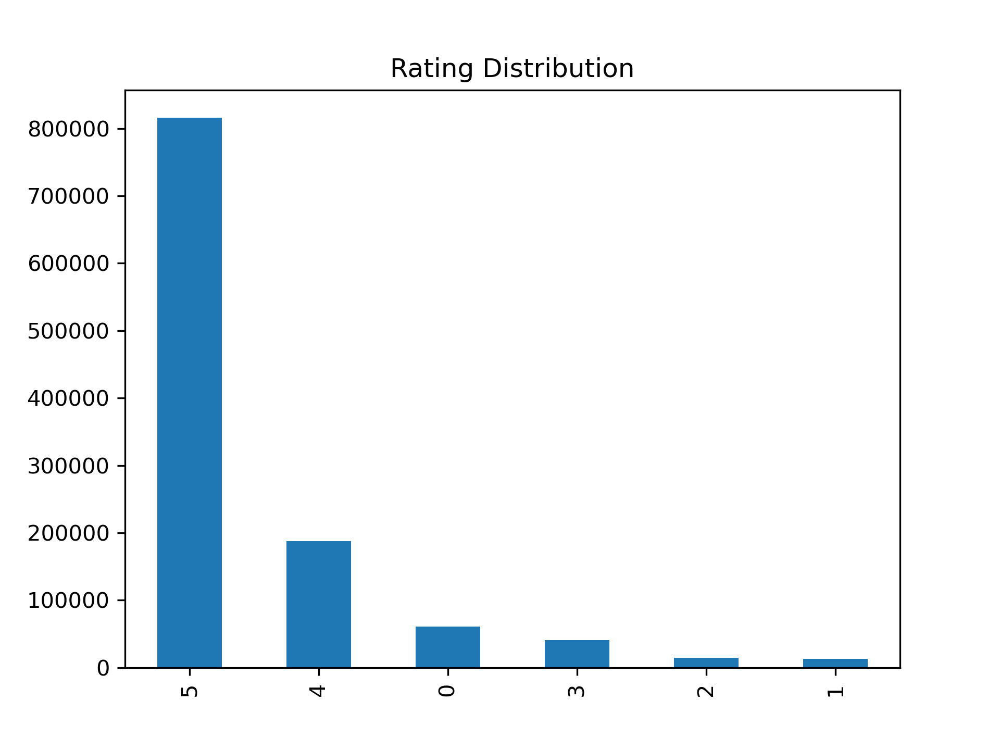

# Assignment 2

---

## Abstract 

This report explores the application of predictive modeling techniques for personalized recipe recommendations using a dataset sourced from Food.com. The dataset comprises two key components: recipe metadata and user-recipe interaction data. By leveraging user preferences and recipe attributes, the primary objective is to develop a machine learning model that predicts user ratings for recipes. This task is motivated by the broader goal of designing a recommender system tailored to user preferences in the culinary domain. Through exploratory data analysis (EDA), we uncover patterns, trends, and anomalies in the data, which inform feature engineering and model selection. The findings and methodologies presented in this report serve as a foundation for building a robust recommendation engine, showcasing the potential for data-driven personalization in the context of online recipe platforms.

--- 

## Data

The dataset used in this study is sourced from [Food.com](https://www.food.com/) and comprises two key components: **recipe metadata** and **user-recipe interactions**. The `recipe` dataset contains detailed information about individual recipes, including attributes such as preparation time, number of steps, and list of ingredients, while the interaction dataset captures user ratings and reviews for recipes. Together, these datasets form the foundation for building a recommender system that predicts user ratings for recipes.

### Dataset 1 : `recipes` 

#### Size and Composition

The recipe dataset consists of **231,637** entries and 12 columns, representing the metadata of various recipes. Each row corresponds to a unique recipe, with features such as `name`, `id`, `minutes`, `n_steps`, `n_ingredients`, and others.

#### Key Statistics:

|       |     id |          minutes |   contributor_id |      n_steps |   n_ingredients |
|:------|-------:|-----------------:|-----------------:|-------------:|----------------:|
| count | 231637 | 231637           | 231637           | 231637       |    231637       |
| mean  | 222015 |   9398.55        |      5.53489e+06 |      9.7655  |         9.05115 |
| std   | 141207 |      4.46196e+06 |      9.97914e+07 |      5.99513 |         3.7348  |
| min   |     38 |      0           |     27           |      0       |         1       |
| 25%   |  99944 |     20           |  56905           |      6       |         6       |
| 50%   | 207249 |     40           | 173614           |      9       |         9       |
| 75%   | 333816 |     65           | 398275           |     12       |        11       |
| max   | 537716 |      2.14748e+09 |      2.00229e+09 |    145       |        43       |

- Recipes require an average of **9.8 steps** and use approximately **9 ingredients on average**.
- The preparation time (minutes) is highly variable, **ranging from 0 minutes to 2.14 billion minutes**, the latter being an apparent outlier.
- Missing data is minimal, with only **4,979 missing descriptions** and **one missing recipe name**.

#### Interesting Findings:

- The distribution of minutes is skewed, with most recipes **requiring under 100 minutes**, but extreme outliers significantly inflate the range. 
- A small number of recipes share very common ingredient combinations, such as ['eggs', 'water'], ['flour', 'baking powder', 'salt'], and ['butter', 'sugar', 'flour'].
- Recipes show varying levels of complexity, with the number of steps (`n_steps`) and number of ingredients (`n_ingredients`) distributed broadly, indicating diversity in the types of recipes available.

### Dataset 2 : `interactions`

#### Size and Composition
The interaction dataset contains **1,132,367** entries across 5 columns: `user_id`, `recipe_id`, `date`, `rating`, and `review`. Each row represents an interaction between a user and a recipe, where the rating indicates user satisfaction.

#### Key Statistics:

|       |          user_id |        recipe_id |      rating |
|:------|-----------------:|-----------------:|------------:|
| count |      1.13237e+06 |      1.13237e+06 | 1.13237e+06 |
| mean  |      1.38429e+08 | 160897           | 4.41102     |
| std   |      5.01427e+08 | 130399           | 1.26475     |
| min   |   1533           |     38           | 0           |
| 25%   | 135470           |  54257           | 4           |
| 50%   | 330937           | 120547           | 5           |
| 75%   | 804550           | 243852           | 5           |
| max   |      2.00237e+09 | 537716           | 5           |

- The dataset includes **226,570 unique users** and **231,637 unique recipes**, suggesting wide user coverage across recipes.
- Ratings are predominantly positive, with **72% of interactions rated 5 stars** and very few ratings of 1 or 2 stars.

#### Interesting Findings:

- A significant proportion of reviews are highly positive, which may introduce a bias into the model. This skew suggests that users are generally satisfied with the recipes they interact with, but it also presents challenges for the model to predict lower ratings.
- A small fraction of interactions (169 entries) have missing reviews, but these do not affect the integrity of the primary rating column.
- Sparse interactions across users and recipes highlight the long-tail nature of the data, with some recipes and users having disproportionately high levels of activity.

---

## Predictive Task

Recommender systems have become an integral component of personalized user experiences, particularly in domains such as e-commerce, entertainment, and online platforms. In this study, we focus on the culinary domain, leveraging data from Food.com to design a recommendation engine that predicts user ratings for recipes. With over 1.1 million user-recipe interactions and metadata for over 230,000 recipes, the dataset offers a rich source of information to uncover user preferences and predict future interactions.

The primary task involves building a predictive model to estimate user ratings for unseen recipes based on historical interactions and recipe attributes. This task is not only a foundational challenge in recommender systems but also has practical implications for improving user engagement and satisfaction on recipe-sharing platforms. By incorporating both recipe-level features (e.g., preparation time, ingredients, number of steps) and user-recipe interactions, this study aims to identify key predictors of user satisfaction and design a model that can generalize effectively across diverse user groups.

To address the predictive task, we aim to predict **user ratings for recipes** by leveraging a combination of user-recipe interactions and recipe metadata. This task is critical for designing a personalized recommendation system that suggests recipes aligned with user preferences and past behavior. Below, we outline the steps for evaluating the model, selecting baselines, assessing predictions, and processing the data to extract relevant features.

### Evaluation of the Model

To evaluate the model's performance, we will employ a hybrid of the following metrics:

#### Root Mean Squared Error (RMSE):

RMSE measures the average magnitude of error between predicted ratings and actual ratings. It is suitable for evaluating numerical predictions like ratings and penalizes larger errors more heavily.

$$RMSE = \sqrt{\frac{1}{n} \sum_{i=1}^n (y_i - \hat{y_i})^2}$$

The dataset shows a significant skew toward higher ratings (e.g., a majority of ratings are 4 or 5). This bias implies that small deviations in predictions for high ratings (e.g., predicting 4.2 instead of 5) might not matter as much, but large errors (e.g., predicting 1 instead of 5) could be critical.

While most ratings are concentrated around the 4-5 range, there are instances of low ratings (e.g., 1s or 2s). If outliers are genuine reflections of user dissatisfaction, RMSE could emphasize their impact. RMSE might be better suited to capture these large deviations.

### Baselines for Comparison

We will compare our model's performance against a Jaccard-similarity-based collaborative filtering approach. This model employs a collaborative filtering approach based on Jaccard similarity between sets of users who have interacted with recipes, where jaccard similarity is defined as: 

$$J(i, j) = \frac{|U_i \cap U_j|}{|U_i \cup U_j|}$$

For a user $u$ and a recipe $i$, the predicted rating is computed as:

$$\hat{r}_{u,i} = \frac{\sum_{j \in R_u} \text{Jaccard}(U_i, U_j) \cdot r_{u,j}}{\sum_{j \in R_u} \text{Jaccard}(U_i, U_j)}$$

where \
$r_{u, j}$ : Rating given by user $u$ to recipe $j$, \

If no similar recipes are found then the global average rating is used instead.

### Features and Data Processing

To ensure the model effectively predicts user ratings, we will carefully preprocess the data and select relevant features.

### Features Used:

**Recipe Metadata:**
- Preparation Time (`minutes`): Recipes with shorter preparation times may correlate with higher ratings for users with busy schedules.
- Number of Steps (`n_steps`): Indicates recipe complexity, which might influence user ratings.
- Number of Ingredients (`n_ingredients`): Similar to steps, this could signal simplicity or difficulty.

**User-Recipe Interaction Data:**
- User ID (`user_id`) and Recipe ID (`recipe_id`): Encoded as numerical features for similarity functions, like Jaccard, cosine, etc.
- Review Text (`review`): Sentiment analysis can extract insights about user satisfaction. This would require some feature extraction. 
- Rating (`rating`): Target variable for supervised learning.

### Assessment of Model Validity

To validate the model's predictions and ensure robustness:

#### Cross-Validation:
Employ K-fold cross-validation to mitigate overfitting and assess model performance on unseen data.

#### Error Analysis:
Analyze residuals to identify patterns where the model underperforms, such as specific user or recipe segments.

#### Baseline Comparison:
Ensure the model consistently outperforms baseline metrics like global average and collaborative filtering.

### Model Used: Stochastic Gradient Descent

Our model is a Stochastic Gradient Descent (SGD) based linear regression model that predicts ratings using a combination of global, user-specific, and item-specific biases. The prediction formula is:

$$\hat{r}_{u, i} = w_0 + w_u + w_i$$

Where \
$\hat{r}_{u, i}$ : the predicted rating for recipe $i$ given by user $u$, \
$w_0$ : Global bias term, \
$w_u$ : User-specific bias, and \
$w_i$ : Recipe-specific bias.

We decided to use SGD because it is computationally efficient for large datasets due to its ability to update weights incrementally using mini batches or even single samples. Also, this model expliciitly accounts for user and item biases, which are critical in reccomendation systems to adjust for inherent rating tendencies. SGD can adapt to different types of input features or extended to factorization models like matrix factorization if needed making it a good model to use for this predictive task.

We will optimize this model by adjusting the hyperparameters to reduce overfitting and create a more accurate model. For instance, the learning rate was adjusted using a validation set to ensure convergence without overshooting the minimum and regularization terms were added for user and item biases in order to reduce overfitting. Additionally, we experimented with different batch sizes to find a balance between computation time and convergence stability. In order to optimize this model, we also attempted to monitor the training of the model with the validation RMSE so that it would stop when performance would start improving in order to reduce overfitting. 

An issue we encountered with scalability was that fine-tuning some of the parameters for the large datasets was computationally intensive. In order to test out different parameter values we had to reduce the features in order to improve the runtime while testing. Additionally, without propoer regularization, the model would overfit to users or recipes with fewer ratings. Adding a regularization parameter helped mitigate this issue.

#### Unsuccessful Model
While working on creating a model that can predict the rating, we did create a model that was unsuccessful. While attempting to create a model that used Jaccard Similarity for Users, our similarity function timed out. This function timed out because of the large dataset that it was attempting to go through. Therefore, we decided to attempt a model that used Jaccard similarity between sets of users who have interacted with recipes.

#### Baseline Model
We first created a baseline model that employs a collaborative filtering approach based on Jaccard similarity between sets of users who have interacted with recipes to predict rating. The Jaccard similarity is a straightforward measure that compares the overlap between two sets. It is easy to compute and understand, making it a practical choice for a baseline. However, a con for using this model is that it is computationally expensive. With our baseline model, we got a starting RMSE value of 1.38628. 

#### Model 1: Globel Average Rating

We first created a baseline model that predicted the global average rating for all of the recipes. This model gave us a starting RMSE of 1.26772. This model is good because it captures popular recipes and it requires minimal computational resources, making it efficient for large datasets liek this one. However, it does not account for individual user tastes of preferences, which lead to inaccurate predictions for users who deviate from the average.

#### Model 2: User Average Rating
The second model we created was an user average rating model that predicted a user's rating for a recipe based on their historical average ratings. If the user has no historical rating, then the global average rating was used instead to predict the recipe's rating.

Here the predicted rating $\hat{r}_{u, i}$ for user $u$ and recipe $i$ is defined such that:

$$ \hat{r}_{u, i}=   \left\{
\begin{array}{ll}
      \frac{\sum_{j \in I_u} r_{u, j}}{|I_u|} & \text{if } |I_u| > 0 \\
      r_{global\_average} & \text{otherwise}\\
\end{array} 
\right.  $$

where \
$I_u$ : Set of recipes rated by user $u$, \
$r_{u, j}$ : Rating given by user $u$ to recipe $j$, \
$r_{global\_average}$ : Global average rating, used as a fallback when no similar users are found.

A strength for this model is that it personalizes the predictions. However, this model performs poorly for users with few or no ratings. This model had a slight improvement from the baseline as it gave is RMSE of 1.26212.

#### Model 3: Item Average Rating
The third model we created was an item average rating model that predicted a user's rating for a recipe based on the recipe's historical average ratings. If the recipe has no historical ratings, then the global average rating is used to predict the ratings. 

Here the predicted rating $\hat{r}_{u, i}$ for user $u$ and recipe $i$ is defined such that:

$$ \hat{r}_{u, i} = \left\{
\begin{array}{ll}
      \frac{\sum_{v \in U_i} r_{v, i}}{|U_i|} & \text{if } |U_i| > 0 \\
      r_{global\_average} & \text{otherwise}\\
\end{array} 
\right.  $$

where \
$U_i$ : Set of users who rated recipe $i$, \
$r_{v, i}$ : Rating given by user $v$ to recipe $i$, \
$r_{global\_average}$ : Global average rating, used as a fallback when no similar users are found.

This model's strength is that it captures popular recipes. However, it fails to account for individual preferences of the user's and how it may impact the rating given for a particular recipe. This model however was not an improvement from the user average rating model with its RMSE value of 1.34657.

#### Model 4: Latent Factor Model
The next model we created was a latent factor model that predicted a user's rating for a recipe using matrix factorization that decomposes the user-item interaction matrix $R$ into two-lower dimensional matrices. 
> - $P$ : User latent factor matrix $(m \times k)$
> - $Q$ : Item latent factor matrix $(n \times k)$

The predicted rating is given by:

$$\hat{r}_{u, i} = \mu + b_u + b_i + p_u^Tq_i$$

Where \
$\mu$ : the global average rating, \
$b_u$ : User-specific bias, \
$b_i$ : Recipe-specific bias, \
$p_u$ : Latent factors for $u$, and \
$q_i$ : Latent factors for $i$

The objective is to minimize the error:

$$\mathcal{L} = \frac{1}{N} \sum_{(u, i)} (r_{u, i} - \hat{r}_{u, i})^2 + \lambda (b_u^2 + b_i^2 + ||p_u||^2 + ||q_i||^2)$$

Where \
${r}_{u, i}$ : the true rating, \
$\lambda$ : regularization term to prevent overfitting.

With this model we an improvement from the user average rating model, since it gave us a RMSE value of 1.238847.

#### Model 5: Singluar Value Decomposition
The last model we created before we making the Stochastistic Gradient Model was the Singluar Value Decomposition (SVD) model. This model decomposes the user-item interaction matrix into latent factors for users and items, which are then used to predict the ratings. We used the SVD model because it has the ability to capture complex user-item interactions effectively. However, this model's weakness is that it is computationally expensive and it is prone to overfitting when the hyperparameters are not carefully tuned. This model slightly improved our accuracy from the latent factor model with a RMSE value of 1.234234.

#### Final Model: Stochastistic Gradient Model
In the end we chose to use the Stochastistic Gradient Model because it striked a balance between scalability and predictive performance. By incorporating user and item biases, the model captures the essential patterns in the data without being overly complex. This model had the best performance with a RMSE of 1.22856. The strengths for using this model are that it computationally efficient compared to the more complex collaborative filtering methods and it also incorporates the user and item biases to reduce the effects of overrating and underrating. However, this model is very sensitive to hyperparameters, so choosing the learning rate, regularization rate, and the number of epochs significantly affect its performance.

### Literary Analysis

The problem we are studying focuses on personalized recipe generation using user interaction data and historical preferences. This research builds on existing literature at the intersection of natural language processing (NLP) and recommender systems. The dataset used in this work is from Food.com, a large collection containing over 230,000 recipes and over 1,000,000 user-recipe interactions spanning 18 years (2000-2018). After preprocessing, the dataset includes 180,000 recipes and 700,000 reviews, with splits designed to evaluate user-specific personalization. The recipes chosen for this study include at least three steps and between 4 and 20 ingredients to ensure quality and usability.

Previous work in this domain includes Majumder et al.’s study on personalized recipe generation, which introduced techniques for generating recipes based on incomplete user inputs. Their work utilized encoder-decoder architectures with attention mechanisms to incorporate historical user preferences, demonstrating that personalization significantly improves recipe coherence and alignment with user tastes (Majumder et al., 2019). Their approach highlights the importance of personalized input in recipe generation, as recipes tailored to user preferences tend to have higher ratings and engagement.

Further, datasets such as Recipe1M have been widely used to study recipe generation, focusing on ingredient prediction and instructional text generation. However, these datasets lack explicit user interaction data, limiting their ability to provide personalized recommendations. In contrast, the Food.com dataset’s integration of user reviews provides a richer basis for understanding individual preferences and improves the quality of personalized recipes.

In terms of state-of-the-art methods, recent advancements in personalized recommender systems have utilized transformer-based models such as BERT and GPT, which leverage attention mechanisms to enhance the coherence and diversity of generated text. Studies like those by Sun et al. (2021) demonstrate the use of these models for recipe generation, achieving superior results in terms of recipe coherence and user satisfaction. Additionally, integrating user and item embeddings into the generation process has shown significant improvements in personalization. For instance, the work of He et al. (2017) on neural collaborative filtering (NCF) illustrates the effectiveness of combining collaborative filtering with deep learning techniques for better predictive accuracy in recommendation systems.

Matrix factorization and collaborative filtering remain foundational methods for recommender systems. These techniques rely on latent factors to uncover hidden patterns in user-item interactions. Notable works, such as the collaborative filtering approach by Koren et al. (2009), have demonstrated the effectiveness of incorporating user-item biases into the model, improving recommendation quality. Regularization is also an important aspect of these methods, as it helps prevent overfitting by penalizing overly complex models, which is in line with standard practices in the literature (Rendle, 2012).

However, our approach differs from more advanced methods such as neural collaborative filtering and factorization machines with neural networks. While these methods typically offer higher predictive accuracy, they often require more computational resources and can be difficult to scale to large datasets. For instance, the use of deep learning techniques like those in the work of Chen et al. (2020) can lead to performance gains but at the cost of increased complexity and computational demands. In contrast, our approach, which utilizes stochastic gradient descent (SGD) and simple bias terms, is computationally efficient and easier to deploy in practice, particularly for very large datasets where scalability is a concern.

#### Reference
- Majumder, B. P., Li, S., Ni, J., & McAuley, J. (2019). Generating Personalized Recipes from Historical User Preferences. EMNLP 2019.
Sun, L., et al. (2021). Improving Recipe Generation with Pretrained Language Models: A Case Study on Food.com. Conference on Empirical Methods in Natural Language Processing (EMNLP).
- He, X., Liao, L., Zhang, H., Nie, L., & Hu, X. (2017). Neural Collaborative Filtering. Proceedings of the 26th International Conference on World Wide Web (WWW).
- Koren, Y., Bell, R., & Volinsky, C. (2009). Matrix Factorization Techniques for Recommender Systems. Computer Science Department, University of California, San Diego.
- Rendle, S. (2012). Factorization Machines. Proceedings of the 2012 IEEE 11th International Conference on Data Mining.
- Chen, X., et al. (2020). Factorization Machines with Neural Networks for Collaborative Filtering. ACM Transactions on Intelligent Systems and Technology (TIST).

### Results and Conclusion
The predictive model developed in this study aimed to estimate user ratings for recipes from the Food.com dataset. A Stochastic Gradient Descent (SGD) based linear regression model was chosen for this task, leveraging biases for both users and recipes. Here are the key findings and conclusions:

#### Model Performance:
The SGD-based model showed promising results when compared to simpler baseline models, such as predicting similarity using the Jaccard index. The Jaccard index baseline model resulted in an RMSE of 1.38628. However, after introducing user and recipe-specific biases through the SGD model, we observed a significant improvement, reducing the RMSE. This indicates that the model successfully captured variations in user preferences and recipe characteristics, improving the accuracy of predictions over the baseline approach.

#### Feature Representations:
Recipe Metadata Features: The features such as `minutes`, `n_steps`, and `n_ingredients` provided valuable insights into recipe complexity and user preferences. For example, shorter preparation times were generally associated with higher ratings, particularly among users with busier schedules. These features helped capture the inherent simplicity or complexity of a recipe, which influenced ratings. However, features like `tags` and `nutrition` did not contribute significantly to the model’s performance. These features were often inconsistent or too sparse to provide meaningful insights. These features introduced noise rather than meaningful patterns, leading to negligible or negative impacts on prediction accuracy.

#### User-Recipe Interaction Data: 
User-specific biases were crucial for tailoring the predictions to individual preferences. The inclusion of interaction features (like user_id and recipe_id) enabled the model to learn personalized behaviors and preferences, improving prediction accuracy. However, issues like sparse interactions for certain users or recipes did lead to challenges in overfitting, which was mitigated through regularization techniques.

#### Model Interpretation:
The model’s parameters (global bias, user-specific bias, and recipe-specific bias) provided an interpretation of the overall tendency for users to rate recipes (global bias), as well as individual user preferences (user bias) and recipe characteristics (recipe bias). The negative or positive biases for certain users and recipes revealed trends in how users generally rated specific types of recipes or how certain recipes were universally rated.

#### Why the Proposed Model Succeeded:
The SGD model succeeded because it explicitly accounted for both user and recipe biases, which are crucial in recommendation systems. The optimization of the model through hyperparameter tuning, including regularization to prevent overfitting, allowed the model to generalize well to new, unseen data. Additionally, the model's computational efficiency, particularly with large datasets, made it a good choice for this task.

#### Failures of Other Models:
Simpler models, such as the global average model, failed to capture individual user preferences or recipe-specific variations, leading to higher prediction errors. While the global average might perform well for popular recipes, it does not address the nuances of personal tastes, which are essential for personalized recommendations.

Models without regularization tended to overfit to popular recipes or users with many interactions, skewing the predictions toward the majority behaviors in the dataset. By introducing regularization terms for the user and item biases, the model was able to account for the long-tail nature of the data and avoid overfitting to minority interactions.

#### Significance of Results:
This model demonstrates the power of bias-based approaches, such as those used in collaborative filtering methods, to predict user ratings in a domain as subjective as recipe preferences. By leveraging both metadata and interaction data, the model creates a more personalized experience for users, making it more applicable for practical recommendation systems, such as those used by Food.com.

In conclusion, the proposed SGD-based model outperformed simpler alternatives, and its success can be attributed to its ability to incorporate both global trends and personalized preferences. Regularization, bias handling, and feature engineering were crucial in improving the model’s accuracy and generalizability.
